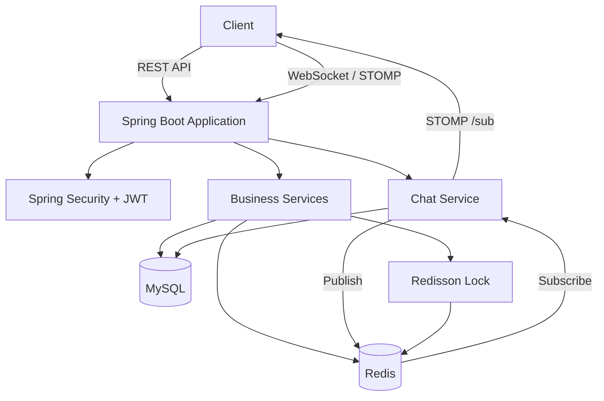

# AIrony

> 숙소 검색부터 예약·결제, 쿠폰, 실시간 문의까지 제공하는 숙박 예약 플랫폼

AIrony는 숙소를 검색하고 예약할 수 있으며, 쿠폰 적용과 실시간 상담 기능을 제공하는 Spring Boot 기반 백엔드 프로젝트입니다.

## 프로젝트 소개

기존 숙박 예약 서비스에서 발생할 수 있는 중복 예약, 선착순 쿠폰 발급, 인기 숙소 집계, 다중 서버 환경의 실시간 메시지 전달 문제를 해결하는 것을 목표로 개발했습니다.

주요 기술적 과제는 다음과 같습니다.

- 실시간 채팅 시스템(WebSocket, STOMP)
- 채팅 메시지 저장 성능 개선(DTO Projection, Proxy)
- 다중 서버 채팅 처리(Redis Pub/Sub)
- 중복 예약 방지(Redisson Distributed Lock)
- 인기 숙소 조회 최적화(Redis Cache)
- 숙소 검색 성능 개선(복합 인덱스)

## 주요 기능

| 기능 | 설명 |
|---|---|
| 회원가입 및 로그인 | Spring Security와 JWT 기반 인증·인가 |
| 숙소 조회 및 검색 | 지역, 가격, 이름, 상태를 조합한 동적 검색 |
| 숙소 찜 | 숙소 찜 등록·취소 및 인기 숙소 랭킹 반영 |
| 예약 및 결제 | 숙박 기간 검증, 쿠폰 적용, 예약·결제 생성 |
| 예약 취소 및 환불 | 예약·결제 상태 변경, 쿠폰 복구 및 환불 이력 생성 |
| 쿠폰 | 쿠폰 조회, 발급, 사용 및 복구 |
| 실시간 문의 채팅 | WebSocket/STOMP 기반 실시간 메시지 송수신 |
| 관리자 상담 | 문의 목록 조회, 상담 수락 및 완료 처리 |

## 기술 스택

### Backend


### Database & Messaging


## 시스템 아키텍처



### 주요 처리 구조

- REST API 인증은 `JwtAuthFilter`에서 처리합니다.
- WebSocket 인증은 STOMP `CONNECT` 시 `WebSocketAuthInterceptor`에서 처리합니다.
- 예약은 숙소와 날짜별 Redisson 분산 락을 사용합니다.
- 쿠폰 발급과 관리자 상담 수락에는 DB 비관적 락을 사용합니다.
- 인기 숙소 순위는 Redis Sorted Set으로 관리합니다.
- 채팅 메시지는 MySQL 저장 후 Redis Pub/Sub을 통해 각 서버로 전달합니다.


## 실행 방법

### 사전 요구사항

- Java 17
- MySQL
- Redis
- Docker Desktop(선택, Redis 로컬 실행용)

### 1. 저장소 복제

```bash
git clone https://github.com/kera9960/AIrony-project.git
cd AIrony-project
```

### 2. MySQL과 Redis 실행

MySQL 서버를 실행하고 `airony` 데이터베이스를 생성합니다.

Redis는 로컬 설치 또는 Docker Desktop을 이용해 실행할 수 있습니다.

```bash
docker run --name redis -p 6379:6379 -d redis
```

### 3. 애플리케이션 설정

`src/main/resources/application-local.yml` 파일을 생성합니다.

```yaml
spring:
  datasource:
    url: jdbc:mysql://localhost:3306/airony
    username: YOUR_DB_USERNAME
    password: YOUR_DB_PASSWORD
    driver-class-name: com.mysql.cj.jdbc.Driver

  jpa:
    hibernate:
      ddl-auto: update
    properties:
      hibernate:
        format_sql: true

  data:
    redis:
      host: localhost
      port: 6379

jwt:
  secret:
    key: YOUR_JWT_SECRET_KEY
  expiration: 3600000
```

> 데이터베이스 비밀번호와 JWT Secret은 Git에 커밋하지 않습니다.
> 프로젝트의 `application.yml`을 참고하여 필요한 설정 값을 추가하세요.

### 4. 애플리케이션 실행

Windows:

```bash
gradlew.bat bootRun --args='--spring.profiles.active=local'
```

macOS 또는 Linux:

```bash
./gradlew bootRun --args='--spring.profiles.active=local'
```

기본 서버 주소:

```text
http://localhost:8080
```

### 5. 테스트 실행

Windows:

```bash
gradlew.bat test
```

macOS 또는 Linux:

```bash
./gradlew test
```

## 프로젝트 구조

```text
src/main/java/com/example/aironyproject
├── common
│   ├── config                 # Security, WebSocket, Redis, QueryDSL 설정
│   ├── entity                 # 공통 생성·수정 시간
│   ├── exception              # 공통 예외 및 오류 코드
│   ├── redisson               # 예약 분산 락
│   ├── response               # 공통 API 응답
│   └── security               # JWT 및 WebSocket 인증
│
└── domain
    ├── accommodations         # 숙소 조회 및 검색
    ├── accommodationLike      # 숙소 찜 및 인기 랭킹
    ├── auth                   # 회원가입 및 로그인
    ├── chat                   # 실시간 문의 채팅
    ├── coupon                 # 쿠폰 조회 및 발급
    ├── payment                # 결제
    ├── refund                 # 환불
    ├── reservation            # 예약 및 취소
    ├── user                   # 회원
    └── userCoupon             # 회원 보유 쿠폰
```

## Wiki

프로젝트의 상세 설계와 기술 문서는 Wiki에서 확인할 수 있습니다.

| 문서                                                                                      | 설명 |
|-----------------------------------------------------------------------------------------|---|
| [ERD](https://github.com/kera9960/AIrony-project/wiki/ERD)                              | 주요 엔티티 관계와 설계 의도 |
| [API 명세](https://github.com/kera9960/AIrony-project/wiki/API-%EB%AA%85%EC%84%B8)        | REST API와 WebSocket/STOMP 명세 |
| [실시간 채팅 시스템 고도화](https://github.com/kera9960/AIrony-project/wiki/실시간-문의-채팅-시스템-고도화-리포트) | WebSocket, STOMP, Redis Pub/Sub 설계 |
| [동시성 제어](https://github.com/kera9960/AIrony-project/wiki/동시성-제어)                                                             | 예약과 쿠폰의 동시성 문제 해결 |
| [캐싱 전략](../../wiki/캐싱-전략)                                                               | Redis Sorted Set 기반 인기 숙소 랭킹 |
| [인덱싱 전략](https://github.com/kera9960/AIrony-project/wiki/백엔드-종합-성능-및-아키텍처-고도화-리포트)      | 숙소 검색 쿼리와 복합 인덱스 적용 |

## 저장소

- GitHub: https://github.com/kera9960/AIrony-project