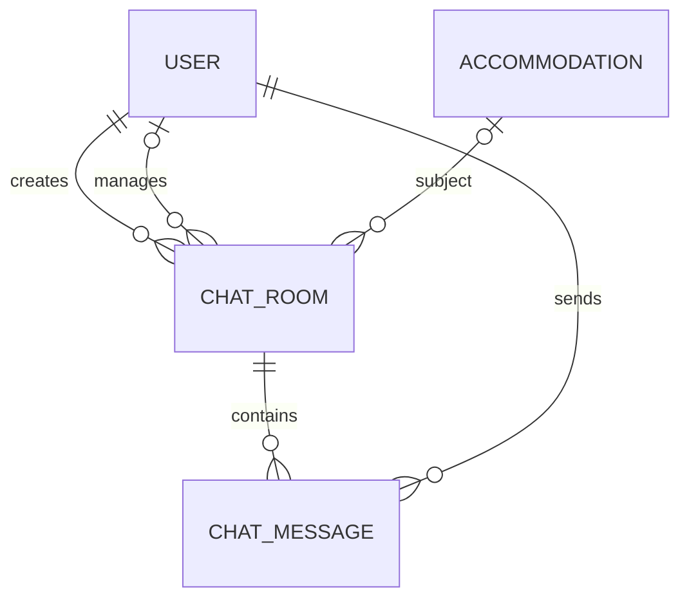
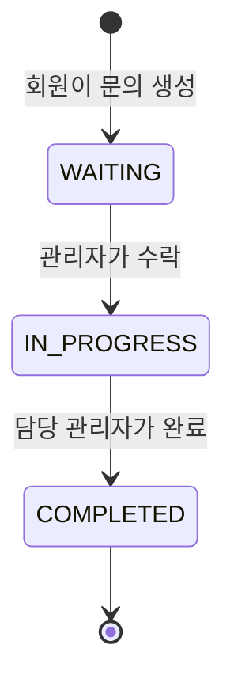
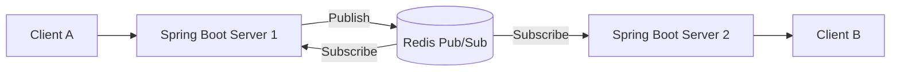
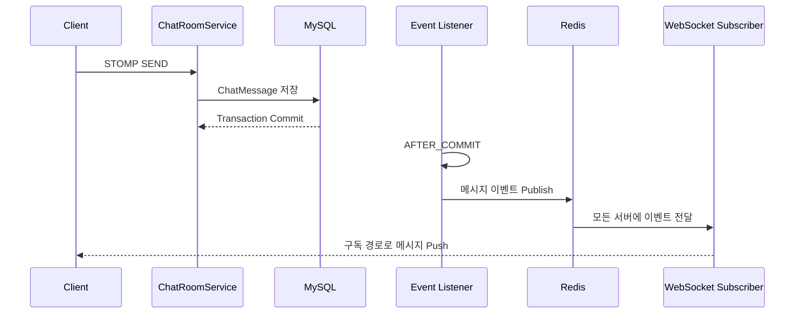
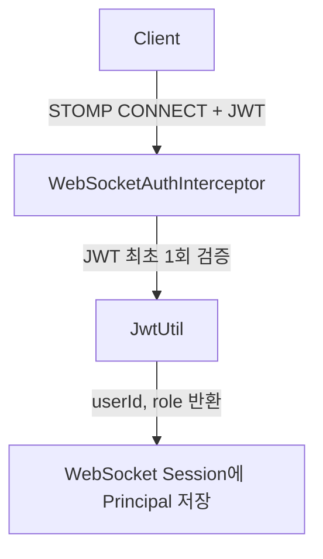
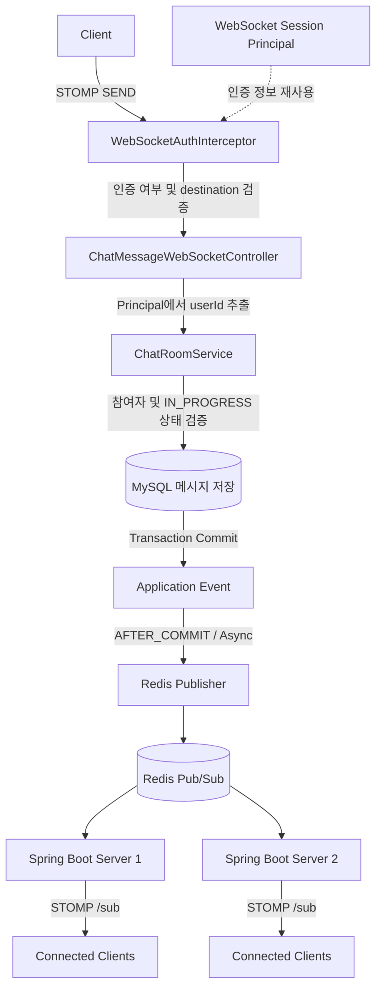

# 실시간 문의 채팅 시스템 고도화 리포트

## REST API 기반 채팅의 한계

초기에는 문의 메시지를 저장하고 조회하는 기능을 REST API 방식으로 설계했습니다.

```text
POST /api/chat-rooms/{chatRoomId}/messages
GET  /api/chat-rooms/{chatRoomId}/messages
```

REST API만으로 메시지를 저장하고 조회할 수는 있지만, 상대방이 새 메시지를 확인하려면 일정 주기로 조회 API를 호출하는 Polling이 필요합니다.

```text
사용자 A → 메시지 전송
사용자 B → 일정 주기로 메시지 조회 API 호출
```

### 문제점

- 새로운 메시지가 없어도 HTTP 요청이 반복됩니다.
- 조회 주기를 짧게 설정하면 서버와 DB 부하가 증가합니다.
- 조회 주기를 길게 설정하면 메시지 전달이 늦어집니다.
- 메신저 수준의 실시간 사용자 경험을 제공하기 어렵습니다.

따라서 메시지가 발생하는 즉시 상대방에게 전달되는 양방향 통신 구조가 필요하다고 판단했습니다.

> 현재 코드에서 메시지 전송은 WebSocket/STOMP로 처리하고, REST API는 채팅방 관리와 메시지 이력 조회에 사용합니다.

---

## WebSocket과 STOMP 도입

WebSocket은 한 번 연결을 맺은 뒤 연결을 유지하면서 서버와 클라이언트가 양방향으로 데이터를 주고받을 수 있습니다. Polling처럼 새 메시지 확인을 위한 HTTP 요청을 반복할 필요가 없습니다.

하지만 순수 WebSocket만 사용하면 메시지 목적지, 채팅방별 구독, 발행·구독 규칙을 직접 구현해야 합니다. 이를 단순화하기 위해 메시징 프로토콜인 STOMP를 함께 적용했습니다.

### 연결 경로

| 구분 | 경로 |
|---|---|
| WebSocket 연결 | `/ws` |
| 메시지 발행 | `/pub/chat-rooms/{chatRoomId}/messages` |
| 채팅방 구독 | `/sub/chat-rooms/{chatRoomId}` |

### 도입 효과

- 지속적인 연결을 통한 실시간 메시지 전달
- 채팅방 단위의 발행·구독 구조 제공
- 목적지 기반 메시지 라우팅 단순화
- Redis Pub/Sub과 연결하기 쉬운 구조 확보
---

## WebSocket 사용자 인증

REST API 요청은 요청마다 Spring Security Filter Chain을 거치며 `JwtAuthFilter`가 JWT를 검증합니다. 
그런데 WebSocket은 최초 Handshake만 HTTP로 시작하고, 연결 이후에는 STOMP 프레임을 주고받으므로 REST 필터가 메시지마다 실행되지 않습니다.

```text
REST API 요청
  ↓
Spring Security Filter Chain
  ↓
JwtAuthFilter
  ↓
Controller

WebSocket 연결
  ↓ HTTP Handshake
연결 수립
  ↓
STOMP CONNECT / SUBSCRIBE / SEND
```

메시지 처리 단계에서도 다음 정보를 확인해야 합니다.

- 누가 메시지를 보냈는가?
- 해당 사용자가 채팅방의 회원 또는 담당 관리자인가?
- 메시지를 저장할 때 어떤 사용자를 발신자로 기록할 것인가?

### 해결 방법

STOMP 인바운드 채널에 `WebSocketAuthInterceptor`를 등록했습니다. 클라이언트는 `CONNECT` 프레임에 JWT를 전달합니다.

```text
Authorization: Bearer {accessToken}
```

인터셉터는 명령별로 다음 항목을 검증합니다.

| STOMP 명령 | 검증 내용 |
|---|---|
| `CONNECT` | Authorization 헤더와 JWT 유효성 검증, Principal 설정 |
| `SUBSCRIBE` | 인증 여부, 구독 경로 형식, 채팅방 참여자 여부 검증 |
| `SEND` | 인증 여부와 메시지 발행 경로 형식 검증 |

서비스 계층에서도 발신자가 채팅방 회원 또는 배정된 관리자인지, 채팅방 상태가 `IN_PROGRESS`인지 다시 검증합니다.

---

## 채팅 도메인 설계



### 채팅방 상태



- `WAITING`: 관리자 배정 대기
- `IN_PROGRESS`: 상담 진행 중이며 메시지 전송 가능
- `COMPLETED`: 상담 완료, 이력 조회만 가능

### ChatRoom과 ChatMessage 연관관계

`ChatMessage`만 `ChatRoom`을 참조하는 단방향 연관관계를 사용했습니다. `ChatRoom`이 메시지 컬렉션을 직접 관리하지 않습니다.

선택 이유는 다음과 같습니다.

- 채팅방 조회 시 누적된 메시지 전체가 함께 로딩되는 것을 방지합니다.
- 대량 메시지로 인한 메모리 사용 증가를 피합니다.
- 메시지 전용 Repository에서 조회와 페이지네이션을 명시적으로 처리할 수 있습니다.
- 불필요한 양방향 연관관계 관리를 제거합니다.

---

## 메시지 전송 DB 조회 최적화

메시지 전송은 채팅 기능에서 가장 빈번한 작업입니다. 기존 방식에서는 메시지 한 건을 저장하기 위해 User와 ChatRoom 엔티티를 각각 조회할 수 있었습니다.

```text
메시지 전송
  ↓
User 전체 조회
  ↓
ChatRoom 전체 조회
  ↓
ChatMessage 저장
```

### User SELECT 쿼리 제거

메시지 저장에는 발신자의 전체 정보가 필요하지 않고 외래 키로 사용할 ID만 필요합니다.
따라서 `userRepository.getReferenceById(senderId)`를 사용해 실제 SELECT 없이 Proxy 참조를 생성했습니다.

### ChatRoom DTO Projection

메시지 전송 가능 여부를 확인하는 데 필요한 값은 채팅방 ID, 회원 ID, 관리자 ID, 상태뿐입니다. `ChatRoomSendValidationProjection`으로 필요한 컬럼만 조회한 뒤 참여자와 상태를 검증합니다.

검증 이후에는 `chatRoomRepository.getReferenceById(chatRoomId)`로 저장에 필요한 참조만 얻습니다.

```text
메시지 전송
  ↓
필요 컬럼만 Projection 조회
  ↓
참여자·상태 검증
  ↓
User / ChatRoom Proxy 생성
  ↓
ChatMessage 저장
```

### 성능 측정 환경

- 회원 수: 200명
- 회원당 메시지 수: 100건
- 총 메시지 수: 20,000건
- 200개 스레드에서 회원별 메시지 동시 전송
- 모든 메시지의 DB 저장 건수 검증

| 구분 | 총 소요 시간(ms) | 평균 처리 시간(ms) |
|---|---:|---:|
| 기존 방식 | 7,302 | 0.365 |
| User Proxy 적용 | 6,671 | 0.333 |
| User Proxy + DTO Projection | 6,412 | 0.321 |

기존 방식 대비 최종 방식은 총 처리 시간이 약 12.2%, 메시지당 평균 처리 시간이 약 12.0% 감소했습니다.

> 각 결과는 동일한 로컬 환경에서 구현 단계를 변경하며 개별 측정한 값입니다. 
> 현재 성능 테스트는 확인용으로 `@Disabled` 처리되어 있으며, 하드웨어와 DB 상태에 따라 결과가 달라질 수 있습니다.
---

## 메시지 조회 성능 개선

채팅 메시지는 서비스 운영 기간이 길어질수록 계속 누적됩니다.

기존 Offset Paging 방식은 페이지가 뒤로 갈수록 앞의 데이터를 건너뛰는 비용이 증가합니다.

```sql
SELECT *
FROM chat_messages
WHERE chat_room_id = :chatRoomId
ORDER BY id DESC
LIMIT 20 OFFSET 100000;
```

### Offset Paging의 문제점

- 조회하려는 페이지 앞의 데이터를 읽고 건너뛰어야 합니다.
- Offset이 커질수록 조회 비용이 증가합니다.
- 실시간으로 메시지가 추가되면 페이지 사이에 데이터가 중복되거나 누락될 수 있습니다.
- 과거 메시지를 계속 불러오는 무한 스크롤에 적합하지 않습니다.

### Cursor Paging 적용

메시지 ID를 Cursor로 사용하는 방식으로 변경했습니다.

```sql
SELECT *
FROM chat_messages
WHERE chat_room_id = :chatRoomId
  AND id < :cursor
ORDER BY id DESC
LIMIT 20;
```

첫 조회에서는 Cursor 없이 최신 메시지를 가져옵니다.

```text
GET /api/chat-rooms/{chatRoomId}/messages?size=20
```

다음 조회부터는 이전 응답의 `nextCursor`를 전달합니다.

```text
GET /api/chat-rooms/{chatRoomId}/messages?cursor=100&size=20
```

응답 구조는 다음과 같습니다.

```json
{
  "status": 200,
  "message": "메시지 목록 조회 성공",
  "data": {
    "messages": [],
    "nextCursor": 80,
    "hasNext": true
  }
}
```

### 복합 인덱스 적용

`chat_messages` 테이블에는 채팅방별 메시지 조회를 위한 복합 인덱스가 선언되어 있습니다.

```java
@Table(
    name = "chat_messages",
    indexes = {
        @Index(
            name = "idx_chat_messages_chat_room_id_id",
            columnList = "chat_room_id, id"
        )
    }
)
```

```text
(chat_room_id, id)
```

인덱스의 첫 번째 컬럼인 `chat_room_id`로 특정 채팅방의 메시지 범위를 좁히고, 두 번째 컬럼인 `id`로 Cursor 이전 메시지를 탐색합니다.

### 개선 효과

- 페이지 번호와 관계없이 마지막으로 조회한 메시지 다음부터 탐색
- 채팅방 ID와 메시지 ID 조건에 복합 인덱스 활용
- 데이터가 누적돼도 Offset 크기에 따른 조회 비용 증가 방지
- 실시간 메시지 추가 시 중복 및 누락 가능성 감소
- 과거 메시지를 불러오는 무한 스크롤 방식에 적합

---

## 다중 서버 환경의 메시지 전달 문제

단일 서버 환경에서는 서버 내부의 Simple Broker만으로 연결된 클라이언트에게 메시지를 전달할 수 있습니다.

```text
사용자 A
   ↓
Server 1
   ↓
사용자 B
```

하지만 사용자가 증가해 애플리케이션 서버를 여러 대로 확장하면 서로 다른 서버에 연결될 수 있습니다.

```text
사용자 A → Server 1
사용자 B → Server 2
```

Server 1의 Simple Broker는 Server 2에 연결된 WebSocket 구독자를 알지 못합니다.

따라서 Server 1에서 발생한 메시지를 Server 2의 사용자에게 전달할 수 없습니다.

```text
사용자 A
   ↓ 메시지 전송
Server 1
   ↓
Server 1의 구독자에게만 전달

Server 2
   ↓
Server 1에서 발생한 메시지를 알 수 없음
```

다중 서버 환경에서도 동일한 채팅방의 사용자들이 메시지를 주고받으려면 서버 사이에서 채팅 이벤트를 공유하는 전달 계층이 필요했습니다.

---

## Redis Pub/Sub 도입

서버 사이에서 채팅 메시지 이벤트를 공유하기 위해 Redis Pub/Sub을 적용했습니다.

모든 애플리케이션 서버는 동일한 Redis 채널을 구독합니다.

```text
Redis Channel: airony:chat:messages
```



### 메시지 전달 흐름

```text
Client A
   ↓ STOMP SEND
Server 1
   ↓ 메시지 저장
MySQL
   ↓ 커밋 완료
Server 1
   ↓ Publish
Redis Pub/Sub
   ↓ Subscribe
Server 1, Server 2
   ↓ STOMP 구독자에게 전달
Client A, Client B
```

Server 1이 Redis에 메시지 이벤트를 발행하면 모든 서버의 Subscriber가 이를 수신합니다.

각 서버는 자신에게 연결된 다음 목적지의 구독자에게 메시지를 전달합니다.

```text
/sub/chat-rooms/{chatRoomId}
```

### 도입 효과

- 서버 사이의 채팅 이벤트 공유
- 애플리케이션 서버의 수평 확장 가능
- 클라이언트가 어느 서버에 연결돼도 동일한 채팅방 메시지 수신
- WebSocket 연결 서버와 메시지 생성 서버의 결합도 감소
- 기존 STOMP 발행·구독 구조와 자연스럽게 연계

### Redis Pub/Sub을 선택한 이유

이 프로젝트의 메시지는 MySQL에 먼저 저장되므로 Redis가 메시지 원본을 보관할 필요가 없습니다.

Redis는 서버 사이에 새로운 메시지 발생 사실을 빠르게 전달하는 용도로만 사용합니다.

또한 프로젝트에서 Redis를 사용하고 있어 별도의 메시지 브로커를 추가하지 않고 기존 인프라를 활용할 수 있었습니다.

### Redis Pub/Sub의 한계

Redis Pub/Sub은 메시지를 영속적으로 저장하거나 재전송하지 않습니다.

서버가 Redis 채널을 구독하지 못한 동안 발행된 메시지는 해당 서버가 나중에 다시 받을 수 없습니다.

```text
Redis 메시지 발행
   ↓
Server 2 일시 중단
   ↓
Server 2는 해당 이벤트를 수신하지 못함
```

이 프로젝트에서는 메시지 원본을 MySQL에 먼저 저장합니다.

따라서 실시간 이벤트를 놓친 클라이언트는 REST API의 메시지 이력 조회를 통해 누락된 메시지를 다시 가져올 수 있습니다.

더 높은 수준의 전달 보장이 필요하다면 Redis Streams, Kafka 또는 RabbitMQ와 같은 메시지 시스템을 검토할 수 있습니다.

---

## 트랜잭션 커밋 이후 메시지 발행

DB 저장이 완료되기 전에 WebSocket으로 메시지를 전달하면 데이터 정합성 문제가 발생할 수 있습니다.

```text
메시지 WebSocket 전달 성공
   ↓
DB 트랜잭션 롤백
   ↓
클라이언트에는 보이지만 DB에는 존재하지 않는 메시지 발생
```

이를 방지하기 위해 메시지 저장 트랜잭션 안에서는 `ChatMessageEvent`만 발행하도록 구성했습니다.

```java
eventPublisher.publishEvent(
    new ChatMessageEvent(chatRoomId, response)
);
```

이벤트 리스너는 `TransactionPhase.AFTER_COMMIT` 시점에 실행됩니다.

```java
@TransactionalEventListener(
    phase = TransactionPhase.AFTER_COMMIT
)
@Async("chatEventExecutor")
public void handle(ChatMessageEvent event) {
    chatMessagePublisher.publish(event);
}
```

DB 트랜잭션이 정상적으로 커밋된 경우에만 Redis에 메시지 이벤트가 발행됩니다.



### 비동기 이벤트 처리

Redis 발행은 별도의 `chatEventExecutor`에서 비동기로 처리합니다.

```text
DB 트랜잭션 커밋
   ├─ 메시지 저장 처리 완료
   └─ 별도 스레드에서 Redis 이벤트 발행
```

이를 통해 메시지 저장 요청이 Redis 통신 완료를 기다리지 않도록 했습니다.

### 적용 효과

- DB 저장에 성공한 메시지만 클라이언트에 전달
- 트랜잭션 롤백 시 잘못된 실시간 메시지 전송 방지
- Redis 발행 작업을 비동기로 분리
- 메시지 저장 트랜잭션과 실시간 전달 책임 분리

### 남아 있는 문제

Redis 발행에 실패하더라도 이미 저장된 DB 메시지는 유지됩니다.

하지만 해당 메시지의 실시간 전달은 누락될 수 있습니다.

```text
DB 저장 성공
   ↓
Redis 발행 실패
   ↓
메시지는 DB에 존재하지만 실시간 전달 누락
```

더 높은 수준의 전달 보장이 필요하다면 다음 방법을 고려할 수 있습니다.

- Redis 발행 재시도
- 실패 이벤트 별도 저장
- Transactional Outbox Pattern
- Redis Streams 또는 별도 메시지 브로커 도입

---

## 최종 아키텍처

### 연결 및 인증



### 메시지 처리



전체 처리 순서는 다음과 같습니다.

```text
[최초 연결]

1. 클라이언트가 JWT를 포함해 STOMP CONNECT 요청
2. WebSocketAuthInterceptor가 JWT 검증
3. JWT에서 userId와 role 추출
4. WebSocket 세션의 Principal에 인증 정보 저장

[메시지 전송]

5. 클라이언트가 STOMP SEND로 메시지 전송
6. WebSocketAuthInterceptor가 인증 여부와 destination 형식 검증
7. ChatMessageWebSocketController가 세션 Principal에서 userId 추출
8. 채팅방 참여자 및 IN_PROGRESS 상태 검증
9. 메시지를 MySQL에 저장
10. 트랜잭션 커밋
11. AFTER_COMMIT 이벤트 리스너 실행
12. Redis Pub/Sub 채널에 메시지 발행
13. 모든 서버의 Subscriber가 이벤트 수신
14. 각 서버가 자신의 STOMP 구독자에게 메시지 전달
```