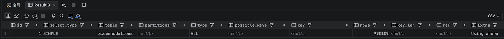
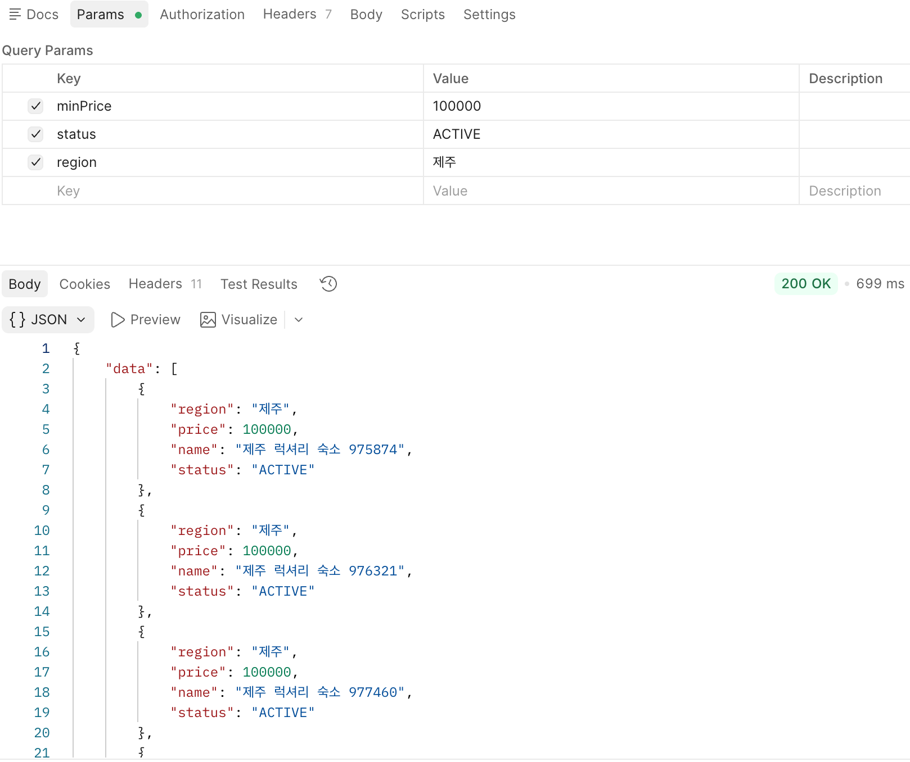
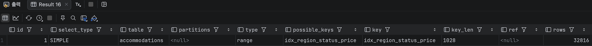
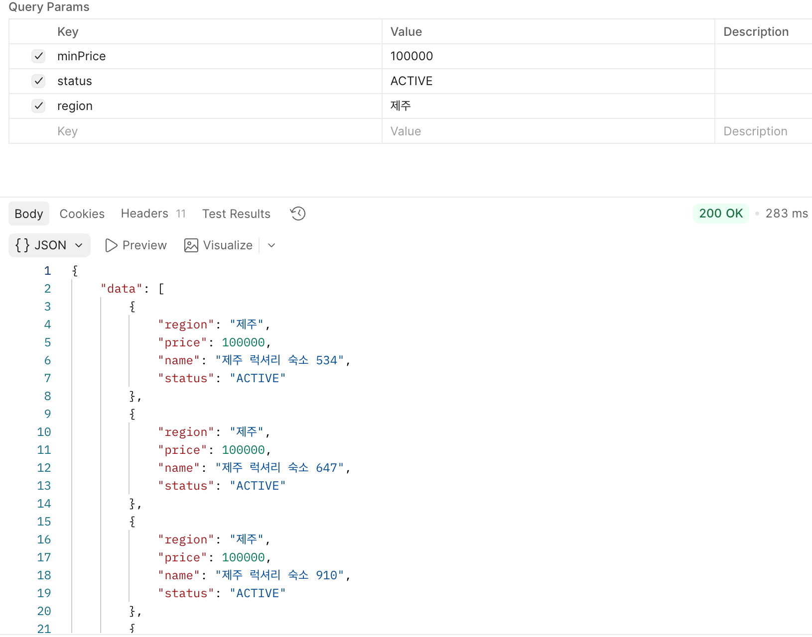

# 백엔드 종합 성능 및 아키텍처 고도화 리포트

## 대용량 숙소 데이터 검색 성능 고도화 (Indexing)

### 1. 왜 이 쿼리를 최적화 대상으로 선정했나요?
- **선정 근거:** 사용자가 애플리케이션 진입 시 가장 먼저 마주하는 '숙소 다중 조건 검색 API'는 트래픽이 집중되는 병목 지점입니다.
- 데이터베이스에 더미 데이터 100만 건을 적재한 상태에서 조회를 수행한 결과, 조건 필터링 시 지연이 발생하는 것을 확인하여 최적화 대상으로 선정했습니다.

### 2. EXPLAIN으로 무엇을 발견했나요?
- **진단 과정:** 최적화 전 쿼리 실행 계획(EXPLAIN)을 분석한 결과, type=ALL, key=NULL 로 표기되는 Full Table Scan 이 발생하고 있었습니다.
- 데이터베이스가 일치하는 데이터를 찾기 위해 990,109건의 레코드를 읽어 들이며(rows=990109) 디스크 I/O 낭비가 일어나고 있음을 진단했습니다.

### 3. 인덱스를 어떻게 설계했고, 왜 그 컬럼에?
- **설계 쿼리:** CREATE INDEX idx_region_status_price ON accommodations (region, status, price);
- **컬럼 선정 및 순서 결정 근거:**
    - **동등 조건( = ) 최우선 배치:** region과 status는 정확히 일치하는 값을 찾는 eq() 조건이므로 가장 앞단에 배치하여 B-Tree 탐색 범위를 즉시 좁혔습니다.
    - **카디널리티(Cardinality) 고려:** 값의 종류가 ACTIVE/INACTIVE 단 2개뿐인 status보다, 제주, 서울, 부산 등 고유값이 더 많은 region의 카디널리티가 높습니다. 따라서 region을 1순위로 배치하여 데이터 필터링 효과를 높였습니다.
    - **범위 조건( < , > ) 후미 배치:** price 는 가격 대역을 찾는 범위 조건입니다. 범위 조건 이후의 컬럼은 인덱스를 타지 못하므로, 정렬된 데이터를 순차적으로 스캔(Index Range Scan)할 수 있도록 가장 마지막인 3순위에 배치했습니다.

### 4. 성능이 얼마나 개선됐나요?
  - ### Before: 인덱스 적용 전
    
    
      - ### **Type:** ALL (풀 테이블 스캔)
      - ### **Rows:** 990,109건
      
  - ### After: 인덱스 적용 후
    
    
      - ### **Type:** range (인덱스 레인지 스캔)
      - ### **Rows:** 32,816건

### 5. 인덱스의 부작용과 Trade-off
- **쓰기 성능 저하:** accommodations 테이블에 새로운 숙소가 추가(INSERT)되거나, 예약 완료로 인해 status가 변경(UPDATE)될 때마다 B-Tree 인덱스도 함께 업데이트되어야 하므로 쓰기 성능저하가 발생합니다.
